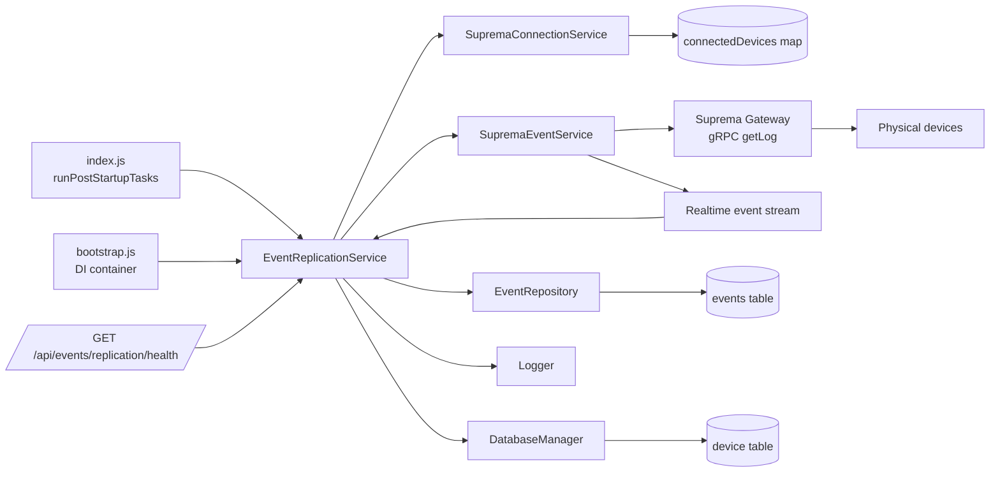
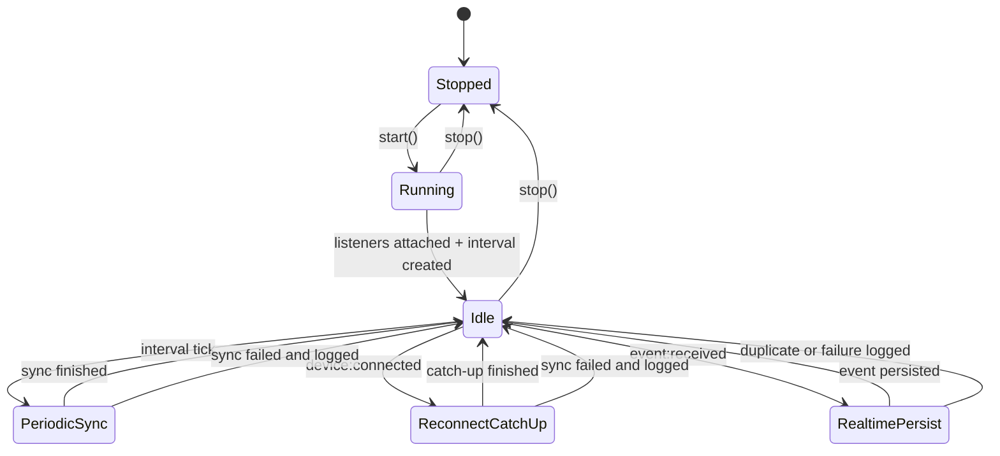
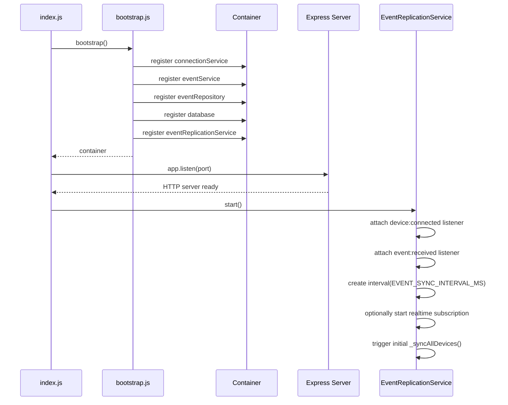
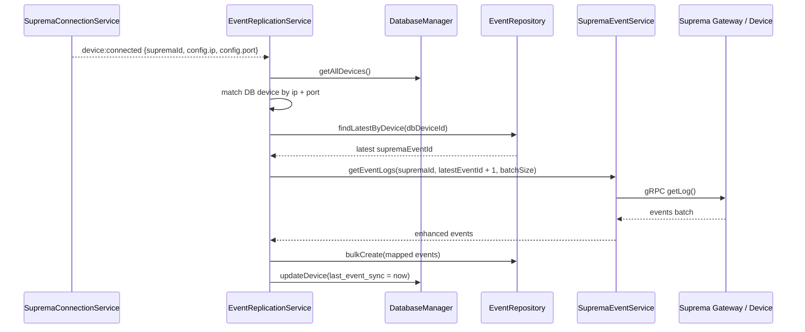
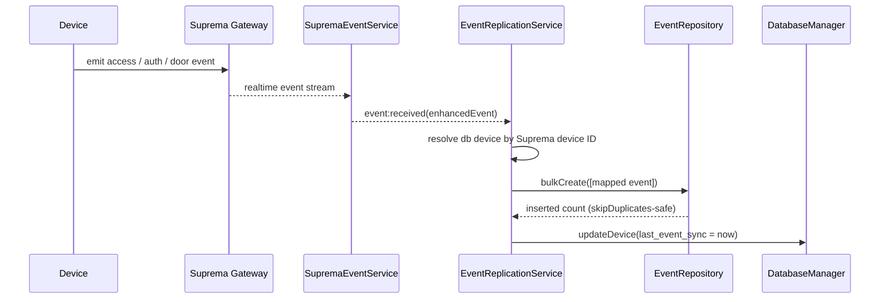
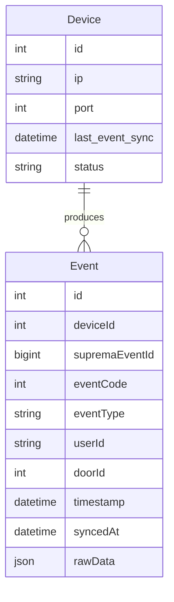

# Event Replication Service Architecture

This document describes the as-built design of the background event replication service implemented in `src/services/eventReplicationService.js`.

## Purpose

The service provides a non-blocking background replication loop that copies events from Suprema devices into the local database.

It solves two operational problems:

1. The API must start even if devices are offline or slow to connect.
2. When a device reconnects after downtime, the backend must catch up on missed events and persist them.

## High-Level Analysis

### What the service does well

1. It is fire-and-forget. Startup is not blocked by device connectivity.
2. It is replay-safe. The fetch cursor is derived from the latest persisted event in the `events` table.
3. It is duplicate-safe. Persistence relies on the unique database constraint on `(deviceId, supremaEventId)` and `createMany(..., skipDuplicates: true)`.
4. It is reconnect-aware. It listens to `connectionService` and immediately runs a catch-up sync on `device:connected`.
5. It is overlap-safe. A per-device lock prevents concurrent syncs for the same database device.
6. It is near-real-time capable. Live events emitted by `eventService` are persisted through the same replication pipeline.

### Important engineering constraint

The Suprema gRPC API used here fetches logs by `startEventId`, not by timestamp.

That means the implementation cannot truly ask the device for “all events after date X”. Instead, it uses the strongest available cursor:

1. Read the latest persisted event ID for the device from the `events` table.
2. Request all device events after that ID.

This is stronger than using `device.last_event_sync` because event IDs are the actual replay cursor exposed by the device log API.

### Meaning of `device.last_event_sync`

In this design, `device.last_event_sync` is not the fetch cursor. It is the timestamp of the last successful replication run for observability and health reporting.

The real cursor is:

`MAX(events.supremaEventId) per device`

## Placement in the Backend

The service is registered in `src/bootstrap.js` and started from `index.js` during post-startup tasks.

It depends on five collaborators:

1. `connectionService` for device connection events and connected-device lookup
2. `eventService` for gRPC event retrieval from the gateway/device
3. `eventRepository` for persistence and cursor lookup
4. `database` for device records and `last_event_sync` updates
5. `logger` for operational logging

It also subscribes to `eventService`'s `event:received` stream and exposes health data through `/api/events/replication/health`.

## Component Graph



## Lifecycle Graph



## Startup Sequence



## Periodic Replication Flow

```mermaid
flowchart TD
    A[Interval tick] --> B[Load active devices from database]
    B --> C{Device connected now?}
    C -- No --> D[Skip device]
    C -- Yes --> E[Resolve Suprema device ID from connectedDevices map]
    E --> F[Read latest stored event from EventRepository]
    F --> G[Compute startEventId = latest supremaEventId + 1]
    G --> H[gRPC getEventLogs(supremaId, startEventId, batchSize)]
    H --> I{Returned events?}
    I -- No --> J[Stop for this device]
    I -- Yes --> K[Map device events to Event rows]
    K --> L[bulkCreate rows with skipDuplicates]
    L --> M[Advance cursor to max event ID + 1]
    M --> N{Batch full?}
    N -- Yes --> H
    N -- No --> O[Update device.last_event_sync = now]
    O --> P[Done]
```

## Reconnect Catch-Up Sequence

This is the critical recovery flow for offline devices.



## Realtime Persistence Sequence

When realtime monitoring is enabled, live device events are persisted through the same mapping and dedup path.



## Data Model Graph



## Cursor Strategy

### Current strategy

The implemented replay cursor is event-ID-based:

```text
startEventId = MAX(events.supremaEventId for device) + 1
```

### Why this is correct for the current API

The event gRPC method is:

```text
getEventLogs(deviceId, startEventId, maxEvents)
```

There is no native “fetch by date range” parameter in this path, so the event ID is the reliable replay key.

### Operational interpretation

1. If no events are stored yet, replication starts at `0` and backfills from the beginning of the retained device log.
2. If the device was offline, reconnect catch-up resumes at the next missing event ID.
3. If old events have rotated out of the device memory before reconnect, the gap cannot be recovered through this API alone.

## Reliability Properties

### Idempotency

Replication is safe to rerun because of:

1. Unique database constraint: `(deviceId, supremaEventId)`
2. `EventRepository.bulkCreate()` calling `createMany(..., skipDuplicates: true)`

### Concurrency control

`_syncing` is a per-device in-memory lock.

This prevents these overlaps:

1. periodic tick + reconnect catch-up for the same device
2. two reconnect events close together for the same device
3. slow batch loop overlapping the next interval for the same device
4. realtime persistence overlapping a periodic catch-up for the same device

### Failure behavior

Failures are logged and swallowed by design.

This keeps the service non-fatal but means replication health must be observed through logs and metrics, not process exit.

## Design Decisions

| Decision | Reason |
|---|---|
| Start in post-startup, not bootstrap | API availability must not depend on device reachability |
| Use latest persisted `supremaEventId` as cursor | Matches the capabilities of `getEventLogs()` |
| Update `last_event_sync` with wall-clock time | Good operational visibility; avoids type mismatch with event IDs |
| Use repository bulk insert | Centralizes dedup and persistence behavior |
| Listen to `device:connected` | Minimizes recovery latency after outage |
| Match reconnecting devices by `ip + port` | Connection event contains the Suprema ID, not the database device ID |
| Persist realtime events through the same mapper | Keeps batch and stream persistence behavior consistent |
| Expose health from the replication service | Keeps operational status close to the actual runtime state |

## Health Endpoint

`GET /api/events/replication/health`

Optional query parameters:

1. `deviceId` to return a single device view

The response contains two sections:

1. `service` — runtime status, interval settings, counters, realtime subscription state
2. `devices` — per-device connection state, lag, last persisted event, last success, last error, and whether a sync is currently running

This endpoint is intended for operational checks and dashboard integration.

## Known Limitations

### 1. Date-based replay is not native

The user requirement is date-oriented, but the device API is event-ID-oriented.

The current implementation therefore uses the latest stored event as the replay boundary. That gives correct incremental behavior, but it is not literally “query after timestamp” at the device API layer.

### 2. In-memory lock is process-local

If the backend is horizontally scaled to multiple Node.js processes, each process would run its own replication loop. At that point the lock must move to a distributed mechanism or replication must be single-leader.

### 3. Polling is serial

`_syncAllDevices()` currently syncs devices one-by-one. This is safer for load, but it reduces throughput when many devices are online.

### 4. Realtime monitoring is still process-local

The current realtime subscription and monitoring state live in memory inside a single Node.js process. In a multi-instance deployment, this must be coordinated so only one instance owns the subscription strategy.

## Suggested Next Improvements

1. Add metrics export for `last successful sync`, `events persisted`, `batch count`, and `sync failures`.
2. Replace serial polling with bounded parallelism if the deployment needs higher throughput.
3. Persist a dedicated replication cursor field if future device APIs expose stronger replay primitives.
4. Add alert thresholds for replication lag and repeated per-device failures.

## Runtime Configuration

| Variable | Default | Meaning |
|---|---:|---|
| `EVENT_SYNC_INTERVAL_MS` | `60000` | Periodic replication interval |
| `EVENT_SYNC_BATCH_SIZE` | `1000` | Maximum events per `getEventLogs()` call |
| `EVENT_SYNC_MAX_BATCHES` | `50` | Safety cap on batches per device per run |
| `ENABLE_REALTIME_EVENTS` | `false` | Enables automatic realtime monitoring and persistence |
| `EVENT_REALTIME_QUEUE_SIZE` | `100` | Queue size for realtime subscription |

## Summary

The event replication service is an infrastructure-side, fire-and-forget recovery mechanism.

Its core engineering idea is simple:

1. never block startup,
2. resume from the latest persisted device event,
3. catch up immediately on reconnect,
4. persist live events through the same deduplicated path,
5. make persistence idempotent.

That design fits the current Suprema event API and gives the backend a practical offline-recovery path without turning device connectivity into a startup dependency.